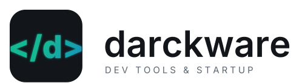

<p align="center">
  <picture>
    <source media="(prefers-color-scheme: dark)" srcset="assets/darckware-lockup-dark.svg">
    <source media="(prefers-color-scheme: light)" srcset="assets/darckware-lockup-light.svg">
    
  </picture>
</p>

# Darckware Remoto

Instalador assistido para preparar estações Windows 11 com **Tailscale**, **RustDesk** ou os dois componentes. O Darckware Remoto baixa os instaladores oficiais, valida hash SHA-256, assinatura Authenticode e fornecedor antes de executá-los, configura o cliente RustDesk para a infraestrutura privada Darckware e registra um relatório local sem credenciais.

> O instalador tem identidade Darckware, mas instala os clientes oficiais de RustDesk e Tailscale. Ele não altera a marca interna desses aplicativos e não inclui binários de terceiros no repositório.

Os binários são baixados dos canais oficiais e assinados pelos respectivos fornecedores; o instalador valida também o hash fixado no manifesto antes de executá-los.

## O que ele faz

- instala Tailscale `1.102.3` em modo não assistido e conecta a estação à tailnet;
- instala RustDesk `1.4.9` e configura os servidores ID e relay privados da Darckware;
- permite acesso ao RustDesk por um Tailscale local ou por uma estação roteadora na rede LAN;
- no modo roteador, cria somente uma rota persistente `/32` para o servidor autorizado;
- testa as portas TCP `21116` e `21117` antes de instalar o RustDesk pelo roteador;
- permite configurar, opcionalmente, uma senha permanente do RustDesk;
- aceita reexecução: componentes existentes são reutilizados e o RustDesk é reconfigurado;
- grava estado e logs sem armazenar a chave Tailscale ou a senha RustDesk.

## Requisitos

- Windows 11 x86-64;
- conta com permissão de administrador;
- Windows PowerShell 5.1 ou PowerShell 7;
- acesso HTTPS aos endpoints oficiais de RustDesk e Tailscale;
- Git, ou acesso ao download ZIP do GitHub;
- para o modo roteador, uma estação previamente preparada conforme [Pré-requisitos do roteador](docs/router-prerequisites.md).

## Instalação rápida

Abra o **Prompt de Comando** ou **PowerShell** e execute:

```powershell
git clone https://github.com/marcelodarckferreira/rustdesk-darckware.git
cd rustdesk-darckware
.\install.cmd
```

O Windows solicitará elevação pelo UAC. Confirme somente se o caminho exibido corresponder ao repositório clonado.

### Sem Git

1. Abra a página do repositório no GitHub.
2. Selecione **Code > Download ZIP**.
3. Extraia todo o ZIP para uma pasta local.
4. Clique duas vezes em `install.cmd`.
5. Confirme a solicitação do UAC.

Não execute `install.cmd` diretamente de dentro do ZIP.

## Escolhas disponíveis

| Seleção | Resultado |
|---|---|
| Tailscale | Instala e conecta somente o cliente Tailscale. |
| RustDesk | Instala o RustDesk usando um Tailscale local já conectado ou uma estação roteadora. |
| Tailscale + RustDesk | Conecta o Tailscale primeiro e só então instala/configura o RustDesk. Não cria rota estática. |

### Chave de autenticação Tailscale

Use uma chave **one-off**, pré-aprovada e com as tags mínimas necessárias. Evite chaves reutilizáveis. O hostname deve:

- ter de 1 a 63 caracteres;
- usar somente letras ASCII, números e hífen;
- começar e terminar com letra ou número;
- não conter espaços, pontos ou comandos.

A chave informada pela interface é mantida como valor seguro e entregue ao Tailscale por arquivo temporário protegido. Ela é removida mesmo quando o enrolamento falha.

## Instalação não interativa

Segredos não são aceitos diretamente na linha de comando. Cada arquivo secreto deve conter somente o valor, ter ACL restrita a Administradores/SYSTEM e ser removido pelo sistema de implantação depois que o processo terminar.

### Tailscale

```powershell
.\install.ps1 -NonInteractive `
  -InstallTailscale `
  -TailscaleHostname 'cliente-loja-01' `
  -TailscaleAuthKeyFile 'C:\Secure\tailscale-auth-key.txt'
```

### RustDesk com Tailscale local

```powershell
.\install.ps1 -NonInteractive `
  -InstallRustDesk `
  -ConnectivityMode LocalTailscale `
  -RustDeskPasswordFile 'C:\Secure\rustdesk-password.txt'
```

`-RustDeskPasswordFile` é opcional.

### RustDesk por estação roteadora

```powershell
.\install.ps1 -NonInteractive `
  -InstallRustDesk `
  -ConnectivityMode Router `
  -RouterIp '192.168.1.10' `
  -ConfirmRouteReplacement
```

O parâmetro de confirmação autoriza apenas a substituição de uma rota anteriormente registrada como gerenciada pelo Darckware Remoto. Rotas conflitantes não gerenciadas são preservadas e causam falha segura.

### Tailscale e RustDesk

```powershell
.\install.ps1 -NonInteractive `
  -InstallTailscale `
  -InstallRustDesk `
  -TailscaleHostname 'cliente-loja-01' `
  -TailscaleAuthKeyFile 'C:\Secure\tailscale-auth-key.txt' `
  -RustDeskPasswordFile 'C:\Secure\rustdesk-password.txt'
```

## Códigos de saída

| Código | Significado |
|---:|---|
| `0` | instalação concluída |
| `1` | falha operacional |
| `2` | entrada inválida |
| `1223` | UAC cancelado ou assistente cancelado |

## Segurança e verificação

Antes de executar um instalador, o Darckware Remoto exige:

1. URL HTTPS oficial e versão fixa;
2. hash SHA-256 idêntico ao manifesto;
3. assinatura Authenticode válida;
4. fornecedor esperado no certificado.

Uma divergência interrompe o fluxo antes de `msiexec.exe` ou do executável RustDesk. Chaves e senhas não são gravadas em estado, resultado ou log. Os binários baixados permanecem fora do Git.

## Logs e estado

Arquivos operacionais ficam em:

```text
%ProgramData%\Darckware\RustDeskInstaller\
```

- `installer.log`: etapas e erros com redação de segredos;
- `state.json`: versões, horário e eventual rota gerenciada;
- `downloads\`: cache local dos instaladores verificados.

Consulte [Solução de problemas](docs/troubleshooting.md) para diagnóstico e recuperação.

## Reexecução e remoção

O instalador é idempotente dentro do escopo documentado:

- uma instalação Tailscale já conectada é reutilizada;
- uma instalação RustDesk existente recebe novamente a configuração fixa;
- uma rota `/32` idêntica é reutilizada;
- uma rota gerenciada divergente só é substituída após confirmação;
- ao usar Tailscale local, somente a rota anteriormente registrada como gerenciada é removida.

O Darckware Remoto **não é um desinstalador**. Remova RustDesk ou Tailscale em **Configurações > Aplicativos > Aplicativos instalados**. Antes de remover manualmente uma rota, confirme destino, gateway e interface conforme o guia de troubleshooting.

## Status de validação

O repositório contém testes Pester e CI para Windows. Uma execução de aceitação em uma VM Windows 11 limpa ainda é obrigatória antes de classificar uma versão como pronta para produção. O roteiro está em [Aceitação Windows 11](docs/windows-11-acceptance.md).

## Licenças

Os scripts produzidos pela Darckware são licenciados sob MIT; veja [LICENSE](LICENSE). RustDesk e Tailscale mantêm suas próprias licenças, marcas, assinaturas e termos. Veja [THIRD_PARTY_NOTICES.md](THIRD_PARTY_NOTICES.md).

Este projeto não afirma que a Darckware criou ou assinou os binários de terceiros.
